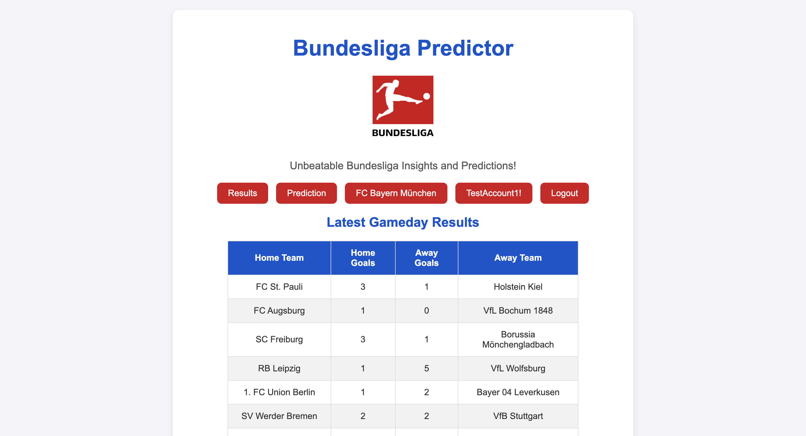

{: .label .label-red }
UI Documentation

# UI Components

This documentation provides an overview of the UI components used in this project.

## UI Screens and Features

### Login
This component provides the user interface for user authentication. It includes:
- Username input field
- Password input field
- Login button

---

### Register
The registration component allows new users to create an account. It includes:
- Username input field
- Password input field
- Confirm password input field
- Choose favorite team dropdown
- Registration button

---

### Home Screen
The home screen serves as the main dashboard after login. It includes:
- Navigation bar:
    - Results
    - Prediction
    - Favorite Team
    - User Settings
    - Log Out
- Latest gameday results
- Current Bundesliga table

---

### Results
The results screen displays historic data from 2016:
- Bundesliga gamedays
- Bundesliga tables

---

### Prediction
The prediction component handles forecasting on historic data. It includes:
- Input field for the gameday
- Prediction results display:
    - Green color for high probability
    - Red color for low probability

---

### Favorite Team
This component provides insights about the user's favorite team. It includes:
- Team information:
    - Trainer
    - Trophies 
- Performance data

---

### User Settings
The user settings component provides configuration options for the user. It includes:
- Profile management:
    - Username
    - Password
    - Favorite Team

